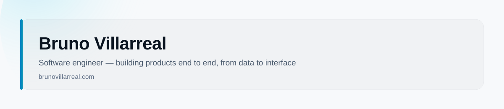

<picture>
  <source media="(prefers-color-scheme: dark)" srcset="./assets/banner-dark.svg">
  <source media="(prefers-color-scheme: light)" srcset="./assets/banner-light.svg">
  
</picture>

I build full-stack products — React/TypeScript on the front, whatever the data needs on the back — and I'm currently pushing further into Rust and cloud infrastructure.

### Featured

**[urbi-ai](https://github.com/brunovillarrrrrr/urbi-ai)** — a real-estate investment analytics prototype built for Mexathon 2025. Interactive map scoring for neighborhoods, an ROI simulator, and a conversational copilot for zone analysis. React 19 + Vite, Tailwind, Mapbox GL, Three.js, Firebase.

### Currently

Deepening Rust and AWS — moving from "it works" to systems I'd trust in production.

### Elsewhere

[brunovillarreal.com](https://brunovillarreal.com)
